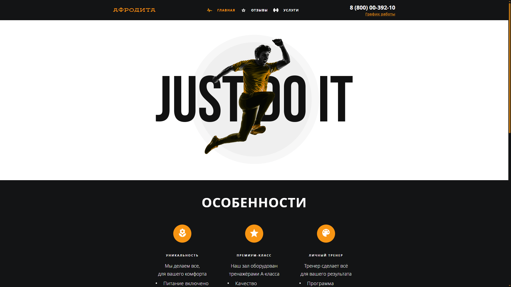

# Проект "Афродита" – Многостраничный адаптивный лендинг фитнес-клуба

## О проекте

Проект представляет собой многостраничный лендинг, разработанный для фитнес-клуба **«Афродита»**. Цель — создать современный и адаптивный сайт с чистой версткой, быстрой загрузкой и логичной структурой. Сайт предоставляет информацию об услугах, зонах клуба, тренерах и форме обратной связи.

Проект выполнен в рамках самостоятельной практики и демонстрирует навыки работы с семантической вёрсткой, методологией БЭМ, сборкой через Webpack и адаптивным дизайном.

## Превью проекта



## Ссылка на демо

- [Посмотреть сайт](https://afrodita-chi.vercel.app/)

## Статус проекта

Проект завершён.

## Функциональность

- **Адаптивная вёрстка**: Корректное отображение на мобильных, планшетах и десктопах.
- **Гибкая сетка**: Используются CSS Flexbox и Grid для построения макета.
- **Семантическая разметка**: Повышает читаемость и доступность сайта.
- **Оптимизация изображений**: Картинки сжаты и адаптированы под Retina-дисплеи.
- **БЭМ-структура**: Удобное масштабирование и поддержка кода.
- **JavaScript**: Подключение скриптов для улучшения взаимодействия.
- **Сборка Webpack**: Упрощённая разработка и продакшен-сборка.

## Технологии и инструменты

- **HTML5** — Разметка с использованием семантических тегов (`<section>`, `<header>`, `<main>`, `<footer>` и т.д.)
- **CSS3** — Стилизация, адаптивность и базовые анимации.
- **Flexbox и Grid** — Построение отзывчивой сетки.
- **Методология БЭМ** — Именование классов и организация файлов.
- **JavaScript (ES6+)** — Поведение страницы.
- **Webpack** — Сборка и оптимизация проекта.
- **Оптимизация изображений** — Уменьшение веса изображений без потери качества.

## Как запустить проект локально

1. Склонируйте репозиторий:
   ```bash
   git clone https://github.com/your-username/afrodita-landing.git

2. Перейдите в директорию проекта:
   ```bash
   cd afrodita-landing

3. Установите зависимости:
   ```bash
   npm install

4. Запуск в режиме разработки:
   ```bash
   npm run start

5. Сборка проекта в режиме разработки:
   ```bash
   npm run build-dev

6. Сборка проекта в продакшен-режиме:
   ```bash
   npm run build-prod

